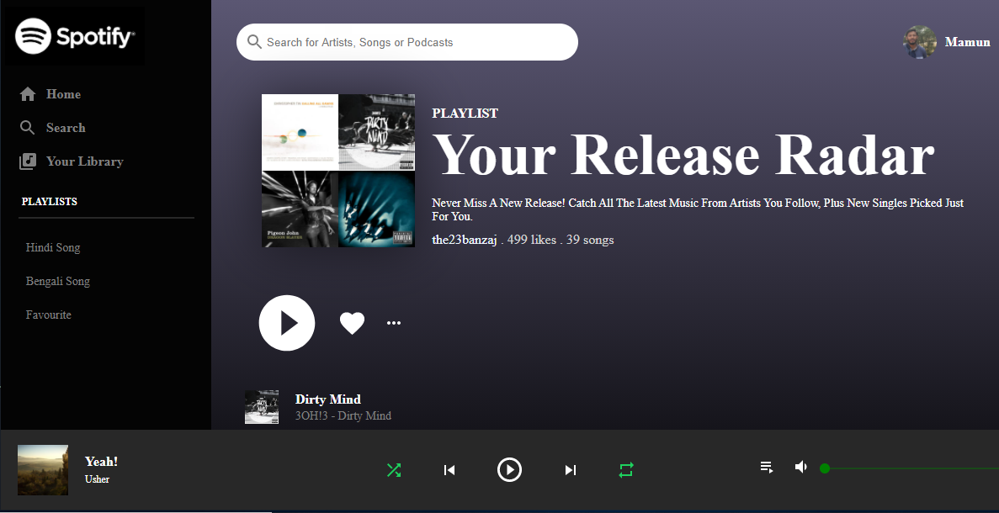
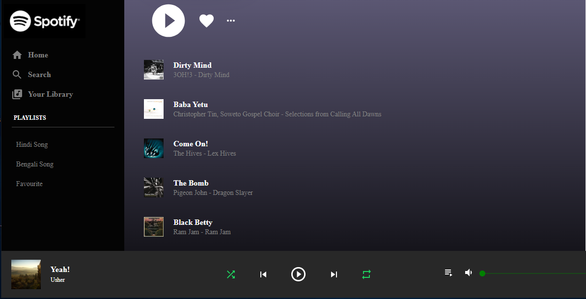

# Spotify Clone 

#### Checkout Live Demo of this Spotify clone: [Live Site](https://spotify-clone-5c591.web.app//) 
#### Better check here: [Live Site](https://angry-wing-9e2972.netlify.app/) *It'll not display acoount's info like playlist, songs, album name etc.*

##### Keywords: *react, react-hooks, react context api, material-ui, spotify api*

#### App Overview 
- [x] Authenticate with user, spotify provides access token
- [x] With that token, we connect our app to spotify-web-api. That gave us the main page of spotify to use
- [x] Fetched real time Playlist from user's account
- [x] Also fetched Your Release Radar songs and some information like artists name, album, how many songs etc

 

 

#### Description

- It's a massive build to learn API fetching I can say.

- Spotify API has it's own User Authentication. But it has no permission to use like user-password login system. You need prior spotify account attached to the browser, only then you can access to spotify main page. I have used my own spotify account id to get real time Playlist and songs to display in this clone. So if you are trying this app, you can't go to with that login.

- You can't play song, play next, control sound or use shuffle in this clone. This can be done only if you have premium spotify developer account maybe.
